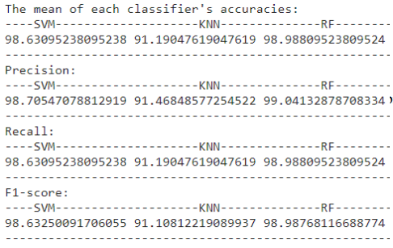
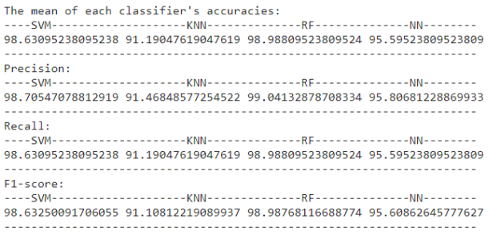

# Arabic-Font-Classification

This project is Arabic Font Identification System; that will be able to identify the font for a given Arabic text snippet. This font identification system proves very useful in a wide range of applications, such as the fields of graphic design like in illustrator arts and optical character recognition for digitizing hardcover documents. Not limited to that, but it also raised interest in the analysis of historical texts authentic manuscript verification where we would like to know the origin of a manuscript. For example, if the manuscript is written in Andalusi font, it is most probably dates to the Andalusian Era. If it were written in Demasqi font, it is most probably dates to the Abbasi Era.

## Project Pipeline
1- Gathering Data: This step is crucial to any machine learning project; we start by
gathering training data and test data.

2- Data Preprocessing: To ensure that data is consistent and feature extraction and
classification steps go smooth and unbiased, we must make some image processing to the
data including denoising and binarization.

3- Feature Extraction: This is a crucial step that is needed for classification, we use a
texture descriptor technique called LPQ that tries to extract as many distinct features as
possible for classification step.

4- Feature Visualization: To ensure that the used feature extraction method is
appropriate for the data, you should visualize it to see if the features are distinct enough
or not (Is this method sufficient or should we use another one?).

5- Classification (ML Model): This is the core element in the project, it’s what
classifies or identifies a data and assigns it to a class, we used multiple classifiers to
compare between them and choose what fits us best. The classifiers are KNN, Random
Forest, SVM, and Neural Network.

6- Performance Analysis: This is the moment of truth, where we evaluate each
classification method used, we evaluate the accuracy, precision, recall, among other
things. We take the best overall classification method to be used in our ML model.
    
 
### Preprocessing Module:
Data preprocessing is very simple here, since we have some restrictions on the input data (Images):
  1- Input image should be at Zero-degree orientation.
  2- Data is printed, not handwritten.
  3- Images are clean, no random writing in the image.
  4- Perspective is normal (like how you see this document).
  
So, Data processing is just three steps:
  1- Gray scale conversion.
  2- Otsu’s threshold is applied for binarization.
  3- K-Folds
What is K-Folds?
  K-folds is a resampling technique in machine learning that is used to make a
  model less biased while training on a limited dataset. It’s very useful when it
  comes to limited datasets just like ours (2000 data sample).
What is K parameter in K-Folds?
  The dataset is divided into K folds, where we train on K – 1 folds, then test on the
  one left, this process is randomized.
      
### Feature Extraction/Selection:
Local Phase Quantization (LPQ) is the chosen method that is used in feature extraction. LPQ is a texture descriptor that is blur-insensitive, here is how it works:
  • At each pixel position x of the image, the local phase information computed over
    M-by-M neighborhood using the 2-D DFT (Discrete Fourier Transform)
  • The equation involved for computing LPQ is described below:
Where wu is the basis vector of the 2-D DFT at the frequency u, and f is another vector containing all M2 image samples from Nx
Why did we choose LPQ over other feature extraction methods like BSIF, LBP or GLCM?
Two simple reasons:
  • LPQ is blur-insensitive, which works well if the image is of low quality.
  • It’s widely used for “Arabic Fonts Calligraphy” identification
 
 
### Model Selection/Training
Model selection is the step where classification of the font happens. We used 4 classification methods which are:
  1- K-Nearest Neighbor (KNN).
    ➢ KNN inspects the nearest K data points and classifies it as the class which
  gathered the most votes.
  2- Random Forest (RF).
    ➢ Random forest creates a multitude of trees and classifies a data point as the class
    most voted by all the trees created.
  3- Support Vector Machine (SVM).
    ➢ SVM is a supervised learning model that can make linear and non-linear
    classifiers, it analyzes data for classification using learning algorithms associated
    with it.
  4- Max Vote
    ➢ Max voting is basically taking the best vote among several classifiers classifying
    the same data sample, if the outputs of classifiers are label 1, label 2, label 1, then
    label 1 would be the chosen classification.
We used the 4 classifiers for comparison purposes and see which one fits the project best, the top performers were RF and SVM models.
At the end we have chosen SVM as it gives the best accuracy / time combination.

### Performance Analysis
This is the moment of truth, we used the 3 classifiers KNN, RF, and SVM
(there is another one that will be discussed later in the report) and we
recorded the precision, recall, accuracy, and F1-Score.

### Other Developed Modules
We were curious to use a model that belongs to the Neural Network category models, we used just a regular neural network with the following
specifications:
  1- One input layer
  2- One output layer
  3- Two hidden layers
We could have increased the number of hidden layers, but that was the limit for us, so here we are
The neural network model was better than KNN classifier only not the other two, maybe the reason was that the dataset was very limited, so training the model wasn’t ideal.

Here is the performance analysis but with the neural network included:

### Enhancements and Future Work
In general, by increasing the dataset size and varying its data, we should
yield better and more accurate results.
For the neural network, we could increase the number of hidden layers or
even make another type of neural network like a CNN.

